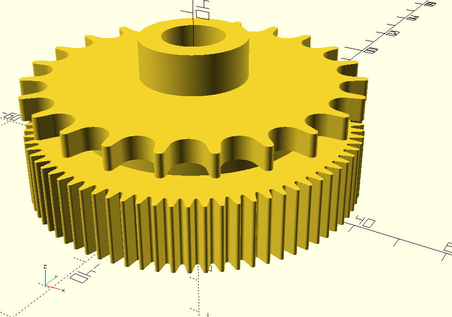

# lurem-c2000-149701710

# PROJET Déplacé ICI (repo moved there): (https://github.com/gnieark/Lurem-C2000-parts)

Fichiers 3D:

Roue dentée qui sert dans le mécanisme de réduction de la vitesse de l'entraineur du bois à raboter, sur une machine Lurem C 2000.

